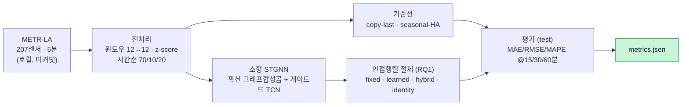

# urban-traffic-forecasting — METR-LA 교통 STGNN

[](LICENSE)

> 🇬🇧 **[English README](README.md)**

도시 교통 **시공간 예측**을 그래프 신경망(STGNN)으로 게이밍 PC(**RTX 3060, 8GB**)에서 **정직하게
축소 재현**한다. **METR-LA** 도로 센서 속도의 미래를 예측하며, **인접행렬을 학습하면 이득인가**(RQ1)와
**다단계 예측에서 오차가 어떻게 누적되는가**(RQ2)를 실측으로 확인한다. 목적은 SOTA 재현이 아니라
**원리 재현·학습**이다.

## 핵심 원칙 — 결과를 지어내지 않는다
실제 실행값(`metrics.json`)만 보고한다. 안 돌린 것은 **한계**로 명시한다. 원데이터·인접행렬·가중치는
**절대 커밋하지 않으며**(`.gitignore` 차단), `scripts/download_data.sh` 가 데이터 취득 방법을 안내한다.

## 파이프라인


## 앵커 · 브리지 대응 (GraphCast ↔ 교통 STGNN)
| GraphCast (Lam+ 2023, 지구 기상) | 교통 STGNN (본 저장소) |
|---|---|
| 지구 격자 → 다중메시 **그래프** | 도로 센서 → **그래프**(거리 기반 엣지) |
| 노드 특징 = 기상 상태 | 노드 특징 = 센서 속도(+ time-of-day) |
| 메시 위 GNN 메시지 패싱 | 확산 그래프합성곱(DCRNN) / adaptive 그래프(Graph WaveNet) |
| 6시간 한 스텝 후 **자기회귀 롤아웃** | 다단계 15/30/60분 예측, **오차 누적** 관찰(RQ2) |
| 고정 메시(지구 기하) | **고정 vs 학습** 인접행렬 절제(RQ1) |

## 재현 방법
```bash
# 0) 환경 (RTX 3060 / CUDA; CPU 폴백 가능)
pip install -r requirements.txt
#   GPU torch: pip install torch==2.6.0 --index-url https://download.pytorch.org/whl/cu124
#   (Windows+Anaconda: 스크립트가 KMP_DUPLICATE_LIB_OK=TRUE 설정 — OpenMP DLL 충돌 회피)

# 1) 데이터 (연구용 공개; 자동 다운로드 안 함 — 스크립트 안내)
pip install gdown
bash scripts/download_data.sh --subset metr-la --fetch   # metr-la.h5 -> data/ (gitignore)

# 2) 스모크 테스트 (합성 텐서; 데이터·모델 불필요, numpy-only)
bash scripts/smoke.sh

# 3) 기준선 (실 METR-LA test split)
python scripts/eval_baselines.py

# 4) STGNN 학습 + 인접행렬 절제(RQ1) — RTX 3060, ~5분/모드
python scripts/train_stgnn.py --modes fixed learned hybrid identity --epochs 50 --batch-size 256
#   -> results/<run_id>/{metrics.json, summary.md}
```

## 실측 결과 (실제 실행값)
실 **METR-LA**(207센서, 5분), 시간순 **70/10/20**, **test = 6,850 윈도우**, masked MAE/RMSE/MAPE
(결측=0 제외), **원 단위(mph)**. 소형 STGNN: 2-layer·hidden 32, 특징 `[z-score speed, time-of-day]`,
seed 42, ≤50 epochs, batch 256, **RTX 3060 · ~5분/모드 · VRAM ~1.4GB**.

| 모델 | MAE@15m | MAE@30m | MAE@60m | RMSE@60m | MAPE@60m (%) | MAE 기울기/스텝 |
|---|---|---|---|---|---|---|
| copy-last (persistence) | 4.017 | 5.094 | 6.795 | 14.209 | 16.71 | 0.332 |
| seasonal-HA (DCRNN 정의) | 4.187 | 4.187 | 4.187 | 7.852 | 13.03 | ~0.000 |
| STGNN **fixed** (도로망 A) | 3.112 | 3.795 | 4.889 | 9.500 | 14.38 | 0.212 |
| STGNN **learned** (adaptive A) | **2.998** | **3.497** | **4.273** | **8.290** | **13.07** | 0.154 |
| STGNN **hybrid** (fixed+adaptive) | 2.998 | 3.516 | 4.298 | 8.318 | 13.03 | 0.159 |
| STGNN **identity** (그래프 없음) | 3.147 | 3.841 | 4.951 | 9.708 | 14.72 | 0.215 |
| *(참조)* *DCRNN 논문 (Li+ 2018)* | *2.77* | *3.15* | *3.60* | *—* | *—* | *—* |
| *(참조)* *HA 논문 (Li+ 2018)* | *4.16* | *4.16* | *4.16* | *7.80* | *13.0* | *~0* |

> ⚠️ 논문값은 **참조용** — 우리 축소 설정(2-layer·특징 2개·≤50ep)과 달라 **직접 비교 아님**.
> 논문값을 우리 결과로 옮겨 적지 않는다. 전체: [`results/stgnn-metr-la-20260704T064753Z/metrics.json`](results/stgnn-metr-la-20260704T064753Z/metrics.json).

### RQ1 — 인접행렬 고정 vs 학습
- **그래프가 도움된다:** `identity`(그래프 없음)가 STGNN 중 최악(4.95@60m). 도로망·adaptive 를 넣으면 개선.
- **학습이 고정보다 낫다:** `learned`(3.00/3.50/4.27)가 `fixed` 도로망(3.11/3.80/4.89)을 전 지평에서 앞섬.
  **답: 데이터로 인접행렬을 학습하는 편이 고정 도로망 그래프보다 이득**(이 축소 설정에서). `hybrid` ≈ `learned`.

### STGNN이 기준선을 이기는가
- **copy-last**: 전 지평에서 STGNN 우세.
- **seasonal-HA**: 15/30분은 STGNN 우세(15m 3.00 vs 4.19), **60분은 seasonal-HA 근소 우위**(4.19 vs 4.27).
  정직하게 병기 — 장기 계절성은 강한 기준선이다.

### RQ2 — 다단계 오차 누적
스텝당 MAE 기울기: copy-last **0.332** → STGNN-learned **0.154**(약 절반). STGNN 은 persistence 대비
**오차 누적이 약 절반**. seasonal-HA 는 구조상 평탄(0) — 타깃 시각의 주(week) 슬롯만 봐서 누적하지 않음.

## 한계 / 안 한 것 (정직하게)
- **SOTA 아님(원리 재현):** 우리 소형 모델은 DCRNN 논문(2.77/3.15/3.60)에 못 미친다. RQ1/RQ2 확인이 목적.
- **60분 지평:** seasonal-HA 가 근소 우위 — 더 큰 모델·긴 학습·풍부한 특징이면 뒤집힐 여지가 있으나
  이번 축소 설정에선 미달.
- **GPU 비결정성:** cudnn.deterministic 이 이 Conv1d 에서 ~25배 느려 benchmark 모드로 학습. 시드는
  고정(초기화·데이터 순서)이나 GPU 합성곱은 bitwise 재현 아님.
- **PEMS-BAY 미실측** — 이번엔 METR-LA 만 학습·평가.
- `smoke.sh` 수치는 합성(`synthetic_dummy=true`)이며 성능이 아니다.

## 데이터 출처·라이선스
- **코드(이 저장소): MIT** — [`LICENSE`](LICENSE) 참조.
- **데이터는 미포함이며 MIT 대상 아님:** METR-LA / PEMS-BAY 는 **연구용 공개** 교통 데이터로
  [DCRNN 저장소](https://github.com/liyaguang/DCRNN)(Google Drive)에서 배포되며, 원 루프검출기
  데이터는 Caltrans PeMS 제공. `scripts/download_data.sh` 로 직접 취득한다. 이 저장소에는
  **원데이터·가중치가 없다**(`.gitignore`).

## References (인용)
BibTeX: [`CITATIONS.md`](CITATIONS.md).
- **[앵커]** Lam, R., et al. (2023). *Learning skillful medium-range global weather forecasting.*
  **Science, 382, 1416–1421.** DOI [10.1126/science.adi2336](https://doi.org/10.1126/science.adi2336) [SCI(E)].
  — GraphCast: 여기서 도시 규모로 대응하는 격자→그래프→롤아웃 패러다임.
- **[브리지]** Li, Y., Yu, R., Shahabi, C., & Liu, Y. (2018). *DCRNN: Data-Driven Traffic Forecasting.*
  **ICLR 2018.** arXiv [1707.01926](https://arxiv.org/abs/1707.01926).
  — 확산 그래프합성곱·METR-LA/PEMS-BAY 벤치마크·HA 기준선 정의.
- **[브리지]** Wu, Z., et al. (2019). *Graph WaveNet for Deep Spatial-Temporal Graph Modeling.*
  **IJCAI 2019.** DOI [10.24963/ijcai.2019/264](https://doi.org/10.24963/ijcai.2019/264).
  — adaptive(학습) 인접행렬·게이트드 시간 합성곱.

## Contact / Author
- **Author:** urbsn4i-sw (GitHub). 학습·재현 목적의 비상업 저장소.
- 문의·재현 이슈는 GitHub Issues 로.
