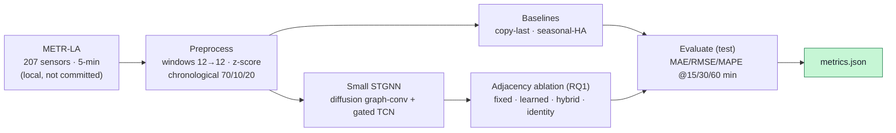

# urban-traffic-forecasting — STGNN on METR-LA

[](LICENSE)

> 🇰🇷 **[한국어 README](README.ko.md)**

A small-scale, **honest reproduction** of urban traffic **spatio-temporal forecasting** with graph
neural networks (STGNN), runnable on a gaming PC (**RTX 3060, 8 GB**). It predicts future road-sensor
speeds on **METR-LA** and studies **whether learning the graph adjacency helps** (RQ1) and **how
multi-step error accumulates** (RQ2). The goal is **learning the principles, not matching SOTA**.

## Core principle — do not fabricate results
Only values from actual runs (`metrics.json`) are reported. Anything not run is stated as a
**limitation**. Raw data, adjacency files, and model weights are **never committed** (blocked by
`.gitignore`); `scripts/download_data.sh` documents how to obtain the data yourself.

## Pipeline


## Anchor & bridge (GraphCast ↔ traffic STGNN)
| GraphCast (Lam+ 2023, global weather) | Traffic STGNN (this repo) |
|---|---|
| Earth grid → multi-mesh **graph** | Road sensors → **graph** (distance-based edges) |
| Node features = weather state | Node features = sensor speed (+ time-of-day) |
| GNN message passing over the mesh | Diffusion graph-conv (DCRNN) / adaptive graph (Graph WaveNet) |
| One 6 h step, then **autoregressive rollout** | Multi-step 15/30/60-min forecast, **error accumulation** watched (RQ2) |
| Fixed mesh (Earth geometry) | **Fixed vs learned** adjacency ablation (RQ1) |

## Reproduce
```bash
# 0) environment (RTX 3060 / CUDA; CPU fallback works)
pip install -r requirements.txt
#   GPU torch: pip install torch==2.6.0 --index-url https://download.pytorch.org/whl/cu124
#   (Windows+Anaconda: scripts set KMP_DUPLICATE_LIB_OK=TRUE to avoid an OpenMP DLL clash)

# 1) data (research-public; not auto-downloaded — see the script)
pip install gdown
bash scripts/download_data.sh --subset metr-la --fetch   # metr-la.h5 -> data/ (gitignored)

# 2) smoke test (synthetic tensors; no data/model needed, numpy-only)
bash scripts/smoke.sh

# 3) baselines (real METR-LA test split)
python scripts/eval_baselines.py

# 4) STGNN training + adjacency ablation (RQ1) — RTX 3060, ~5 min/mode
python scripts/train_stgnn.py --modes fixed learned hybrid identity --epochs 50 --batch-size 256
#   -> results/<run_id>/{metrics.json, summary.md}
```

## Measured results (real runs)
Real **METR-LA** (207 sensors, 5-min), chronological **70/10/20**, **test = 6,850 windows**,
masked MAE/RMSE/MAPE (missing=0 excluded), **original units (mph)**. Small STGNN: 2-layer, hidden 32,
features `[z-score speed, time-of-day]`, seed 42, ≤50 epochs, batch 256, **RTX 3060 · ~5 min/mode · ~1.4 GB VRAM**.

| Model | MAE@15m | MAE@30m | MAE@60m | RMSE@60m | MAPE@60m (%) | MAE slope/step |
|---|---|---|---|---|---|---|
| copy-last (persistence) | 4.017 | 5.094 | 6.795 | 14.209 | 16.71 | 0.332 |
| seasonal-HA (DCRNN def.) | 4.187 | 4.187 | 4.187 | 7.852 | 13.03 | ~0.000 |
| STGNN **fixed** (road-graph A) | 3.112 | 3.795 | 4.889 | 9.500 | 14.38 | 0.212 |
| STGNN **learned** (adaptive A) | **2.998** | **3.497** | **4.273** | **8.290** | **13.07** | 0.154 |
| STGNN **hybrid** (fixed+adaptive) | 2.998 | 3.516 | 4.298 | 8.318 | 13.03 | 0.159 |
| STGNN **identity** (no graph) | 3.147 | 3.841 | 4.951 | 9.708 | 14.72 | 0.215 |
| *(reference)* *DCRNN paper (Li+ 2018)* | *2.77* | *3.15* | *3.60* | *—* | *—* | *—* |
| *(reference)* *HA paper (Li+ 2018)* | *4.16* | *4.16* | *4.16* | *7.80* | *13.0* | *~0* |

> ⚠️ Paper numbers are **reference only** — our reduced setup (2-layer, 2 features, ≤50 epochs) differs,
> so this is **not a direct comparison** and we never copy paper values into our results.
> Full data: [`results/stgnn-metr-la-20260704T064753Z/metrics.json`](results/stgnn-metr-la-20260704T064753Z/metrics.json).

### RQ1 — fixed vs learned adjacency
- **The graph helps:** `identity` (no graph) is the worst STGNN (4.95 @60m). Adding a road-graph or an
  adaptive graph improves it.
- **Learned beats fixed:** `learned` (3.00/3.50/4.27) outperforms `fixed` road-graph (3.11/3.80/4.89) at
  every horizon. **Answer: learning the adjacency from data beats the fixed road-network graph** (in this
  reduced setup). `hybrid` ≈ `learned` (combining does not clearly beat learning alone).

### Does the STGNN beat the baselines?
- vs **copy-last**: STGNN wins at every horizon.
- vs **seasonal-HA**: STGNN wins at 15/30 min (3.00 vs 4.19 @15m); at **60 min seasonal-HA is marginally
  better** (4.19 vs learned 4.27). Reported honestly — long-horizon seasonality is a strong baseline.

### RQ2 — multi-step error accumulation
Per-step MAE slope: copy-last **0.332** → STGNN-learned **0.154** (≈ half). The STGNN **accumulates error
about half as fast** as persistence. seasonal-HA is flat (0) by construction (it reads only the target
time-of-week slot, so it does not accumulate).

## Limitations / not done (honest)
- **Not SOTA (principle reproduction):** our small model trails DCRNN's paper numbers (2.77/3.15/3.60).
  The point is reproducing the *principles* and answering RQ1/RQ2, not matching SOTA.
- **60-min horizon:** seasonal-HA is marginally better than our STGNN — larger models / longer training /
  richer features could flip this, but not in this reduced setup.
- **GPU non-determinism:** `cudnn.deterministic` was ~25× slower on this Conv1d, so training used benchmark
  mode. The seed is fixed (init & data order) but GPU convolutions are not bitwise-reproducible.
- **PEMS-BAY not run** — only METR-LA was trained/evaluated here.
- `smoke.sh` numbers are synthetic (`synthetic_dummy=true`) and are not performance.

## Data source & license
- **Code (this repo): MIT** — see [`LICENSE`](LICENSE).
- **Data is NOT included and NOT covered by MIT:** METR-LA / PEMS-BAY are **research-public** traffic
  datasets distributed via the [DCRNN repo](https://github.com/liyaguang/DCRNN) (Google Drive); the
  underlying loop-detector data is from Caltrans PeMS. Obtain the data yourself via
  `scripts/download_data.sh`. This repository contains **no raw data or model weights** (`.gitignore`).

## References
BibTeX: [`CITATIONS.md`](CITATIONS.md).
- **[Anchor]** Lam, R., et al. (2023). *Learning skillful medium-range global weather forecasting.*
  **Science, 382, 1416–1421.** DOI [10.1126/science.adi2336](https://doi.org/10.1126/science.adi2336) [SCI(E)].
  — GraphCast: the grid→graph→rollout paradigm mirrored here at city scale.
- **[Bridge]** Li, Y., Yu, R., Shahabi, C., & Liu, Y. (2018). *DCRNN: Data-Driven Traffic Forecasting.*
  **ICLR 2018.** arXiv [1707.01926](https://arxiv.org/abs/1707.01926).
  — Diffusion graph-convolution and the METR-LA/PEMS-BAY benchmark + HA baseline definition.
- **[Bridge]** Wu, Z., et al. (2019). *Graph WaveNet for Deep Spatial-Temporal Graph Modeling.*
  **IJCAI 2019.** DOI [10.24963/ijcai.2019/264](https://doi.org/10.24963/ijcai.2019/264).
  — Adaptive (learned) adjacency and gated temporal convolutions.

## Contact / Author
- **Author:** urbsn4i-sw (GitHub). Non-commercial study / reproduction repository.
- Questions / reproduction issues via GitHub Issues.
