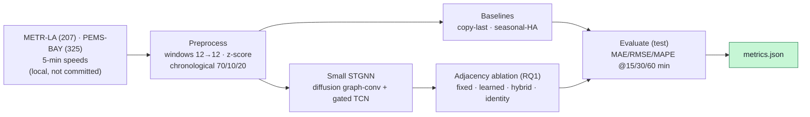

# urban-traffic-forecasting — STGNN on METR-LA & PEMS-BAY

[](LICENSE)

> 🇰🇷 **[한국어 README](README.ko.md)**

A small-scale, **honest reproduction** of urban traffic **spatio-temporal forecasting** with graph
neural networks (STGNN), runnable on a gaming PC (**RTX 3060, 8 GB**). It predicts future road-sensor
speeds on **two cities — METR-LA (LA) and PEMS-BAY (Bay Area)** — and studies **whether learning the
graph adjacency helps** (RQ1, tested across both cities) and **how multi-step error accumulates** (RQ2).
The goal is **learning the principles, not matching SOTA**.

## Core principle — do not fabricate results
Only values from actual runs (`metrics.json`) are reported. Anything not run is stated as a
**limitation**. Raw data, adjacency files, and model weights are **never committed** (blocked by
`.gitignore`); `scripts/download_data.sh` documents how to obtain the data yourself.

## Pipeline


## Anchor & bridge (GraphCast ↔ traffic STGNN)
| GraphCast (Lam+ 2023, global weather) | Traffic STGNN (this repo) |
|---|---|
| Earth grid → multi-mesh **graph** | Road sensors → **graph** (distance-based edges) |
| Node features = weather state | Node features = sensor speed (+ time-of-day) |
| GNN message passing over the mesh | Diffusion graph-conv (DCRNN) / adaptive graph (Graph WaveNet) |
| One 6 h step, then **autoregressive rollout** | Multi-step 15/30/60-min forecast, **error accumulation** watched (RQ2) |
| Fixed mesh (Earth geometry) | **Fixed vs learned** adjacency ablation (RQ1) |

## Reproduce
```bash
# 0) environment (RTX 3060 / CUDA; CPU fallback works)
pip install -r requirements.txt
#   GPU torch: pip install torch==2.6.0 --index-url https://download.pytorch.org/whl/cu124
#   (Windows+Anaconda: scripts set KMP_DUPLICATE_LIB_OK=TRUE to avoid an OpenMP DLL clash)

# 1) data (research-public; not auto-downloaded — see the script)
pip install gdown
bash scripts/download_data.sh --subset metr-la --fetch   # metr-la.h5 / pems-bay.h5 -> data/ (gitignored)

# 2) smoke test (synthetic tensors; no data/model needed, numpy-only)
bash scripts/smoke.sh

# 3) baselines (real test split) — pick a dataset
python scripts/eval_baselines.py --dataset metr-la      # or: --dataset pems-bay

# 4) STGNN training + adjacency ablation (RQ1) — RTX 3060
python scripts/train_stgnn.py --dataset metr-la  --modes fixed learned hybrid identity --epochs 50 --batch-size 256  # ~5 min/mode
python scripts/train_stgnn.py --dataset pems-bay --modes fixed learned hybrid identity --epochs 50 --batch-size 256  # ~13 min/mode (325 sensors)
#   -> results/<run_id>/{metrics.json, summary.md}
```

## Measured results (real runs) — two cities
**Two datasets, same pipeline and same conditions** (2-layer STGNN, hidden 32, features
`[z-score speed, time-of-day]`, seed 42, ≤50 epochs, batch 256, RTX 3060). Chronological **70/10/20**,
**test split**, masked MAE/RMSE/MAPE (missing=0 excluded), **original units (mph)**.

### METR-LA (207 sensors · 2012 · ~8% missing) — test 6,850 windows
| Model | MAE@15m | MAE@30m | MAE@60m | RMSE@60m | MAPE@60m (%) | MAE slope/step |
|---|---|---|---|---|---|---|
| copy-last (persistence) | 4.017 | 5.094 | 6.795 | 14.209 | 16.71 | 0.332 |
| seasonal-HA (DCRNN def.) | 4.187 | 4.187 | 4.187 | 7.852 | 13.03 | ~0.000 |
| STGNN **fixed** (road-graph A) | 3.112 | 3.795 | 4.889 | 9.500 | 14.38 | 0.212 |
| STGNN **learned** (adaptive A) | **2.998** | **3.497** | **4.273** | **8.290** | **13.07** | 0.154 |
| STGNN **hybrid** (fixed+adaptive) | 2.998 | 3.516 | 4.298 | 8.318 | 13.03 | 0.159 |
| STGNN **identity** (no graph) | 3.147 | 3.841 | 4.951 | 9.708 | 14.72 | 0.215 |
| *(reference)* *DCRNN / HA paper* | *2.77 / 4.16* | *3.15 / 4.16* | *3.60 / 4.16* | *—* | *—* | *—* |

Full data: [`results/stgnn-metr-la-…/metrics.json`](results/stgnn-metr-la-20260704T064753Z/metrics.json).

### PEMS-BAY (325 sensors · 2017 · ~0% missing) — test 10,419 windows
| Model | MAE@15m | MAE@30m | MAE@60m | RMSE@60m | MAPE@60m (%) | MAE slope/step |
|---|---|---|---|---|---|---|
| copy-last (persistence) | 1.598 | 2.179 | 3.048 | 7.015 | 6.83 | 0.179 |
| seasonal-HA (DCRNN def.) | 3.029 | 3.027 | 3.024 | 5.841 | 7.12 | ~0.000 |
| STGNN **fixed** (road-graph A) | 1.475 | 1.980 | 2.647 | 5.902 | 6.44 | 0.147 |
| STGNN **learned** (adaptive A) | 1.433 | 1.866 | 2.400 | 5.252 | 5.99 | 0.124 |
| STGNN **hybrid** (fixed+adaptive) | **1.431** | **1.853** | **2.368** | **5.217** | **5.85** | 0.121 |
| STGNN **identity** (no graph) | 1.505 | 2.055 | 2.861 | 6.536 | 6.91 | 0.167 |
| *(reference)* *DCRNN / HA paper* | *1.38 / 2.88* | *1.74 / 2.88* | *2.07 / 2.88* | *—* | *—* | *—* |

> PEMS-BAY has near-zero missing and smoother freeway traffic, so **all errors are much lower** than
> METR-LA — consistent with the literature. Full data:
> [`results/stgnn-pems-bay-…/metrics.json`](results/stgnn-pems-bay-20260704T082908Z/metrics.json).
> ⚠️ Paper numbers are **reference only** (our reduced 2-layer / ≤50-epoch setup differs) — not a direct
> comparison; we never copy paper values into our results.

### RQ1 — fixed vs learned adjacency (holds in **both** cities)
Ordering by 60-min MAE is **identical across both datasets**: `learned ≈ hybrid` **<** `fixed` (road-graph) **<** `identity` (no graph).
- **METR-LA:** learned 4.27 ≈ hybrid 4.30 < fixed 4.89 < identity 4.95
- **PEMS-BAY:** hybrid 2.37 ≈ learned 2.40 < fixed 2.65 < identity 2.86

**Answer: learning the adjacency from data beats the fixed road-network graph, and having a graph beats
none (identity worst) — in both cities.** `hybrid` ≈ `learned` in both (combining fixed+adaptive does not
clearly beat learning alone). This is the RQ1 result **generalizing across two cities**.

### Does the STGNN beat the baselines?
- **METR-LA:** beats copy-last at every horizon; beats seasonal-HA at 15/30 min, but at **60 min HA is
  marginally better** (4.19 vs learned 4.27) — arterial traffic keeps weekly seasonality competitive.
- **PEMS-BAY:** beats **both** baselines at **every** horizon (learned 1.43/1.87/2.40 vs copy-last
  1.60/2.18/3.05 and seasonal-HA ~3.03). On smooth freeway data seasonal-HA is a weak baseline.

### RQ2 — multi-step error accumulation
Per-step MAE slope (STGNN-learned vs copy-last): **METR-LA 0.154 vs 0.332** (≈ half); **PEMS-BAY 0.124 vs
0.179** (~70%). In both cities the STGNN accumulates error more slowly than persistence; seasonal-HA is
flat (~0) by construction (it reads only the target time-of-week slot).

## Limitations / not done (honest)
- **Not SOTA (principle reproduction):** our small model trails the paper numbers (METR-LA DCRNN
  2.77/3.15/3.60; PEMS-BAY 1.38/1.74/2.07). The point is reproducing the *principles* and answering
  RQ1/RQ2 across two cities, not matching SOTA.
- **METR-LA 60-min horizon:** seasonal-HA is marginally better than our STGNN there (on PEMS-BAY the STGNN
  wins at every horizon). Larger models / longer training could flip METR-LA@60m, but not in this setup.
- **GPU non-determinism:** `cudnn.deterministic` was ~25× slower on this Conv1d, so training used benchmark
  mode. The seed is fixed (init & data order) but GPU convolutions are not bitwise-reproducible.
- **Scope:** two datasets (METR-LA, PEMS-BAY); larger STGNN variants and longer horizons are future work.
- `smoke.sh` numbers are synthetic (`synthetic_dummy=true`) and are not performance.

## Data source & license
- **Code (this repo): MIT** — see [`LICENSE`](LICENSE).
- **Data is NOT included and NOT covered by MIT:** METR-LA / PEMS-BAY are **research-public** traffic
  datasets distributed via the [DCRNN repo](https://github.com/liyaguang/DCRNN) (Google Drive); the
  underlying loop-detector data is from Caltrans PeMS. Obtain the data yourself via
  `scripts/download_data.sh`. This repository contains **no raw data or model weights** (`.gitignore`).

## References
BibTeX: [`CITATIONS.md`](CITATIONS.md).
- **[Anchor]** Lam, R., et al. (2023). *Learning skillful medium-range global weather forecasting.*
  **Science, 382, 1416–1421.** DOI [10.1126/science.adi2336](https://doi.org/10.1126/science.adi2336) [SCI(E)].
  — GraphCast: the grid→graph→rollout paradigm mirrored here at city scale.
- **[Bridge]** Li, Y., Yu, R., Shahabi, C., & Liu, Y. (2018). *DCRNN: Data-Driven Traffic Forecasting.*
  **ICLR 2018.** arXiv [1707.01926](https://arxiv.org/abs/1707.01926).
  — Diffusion graph-convolution and the METR-LA/PEMS-BAY benchmark + HA baseline definition.
- **[Bridge]** Wu, Z., et al. (2019). *Graph WaveNet for Deep Spatial-Temporal Graph Modeling.*
  **IJCAI 2019.** DOI [10.24963/ijcai.2019/264](https://doi.org/10.24963/ijcai.2019/264).
  — Adaptive (learned) adjacency and gated temporal convolutions.

## Contact / Author
- **Author:** urbsn4i-sw (GitHub). Non-commercial study / reproduction repository.
- Questions / reproduction issues via GitHub Issues.
